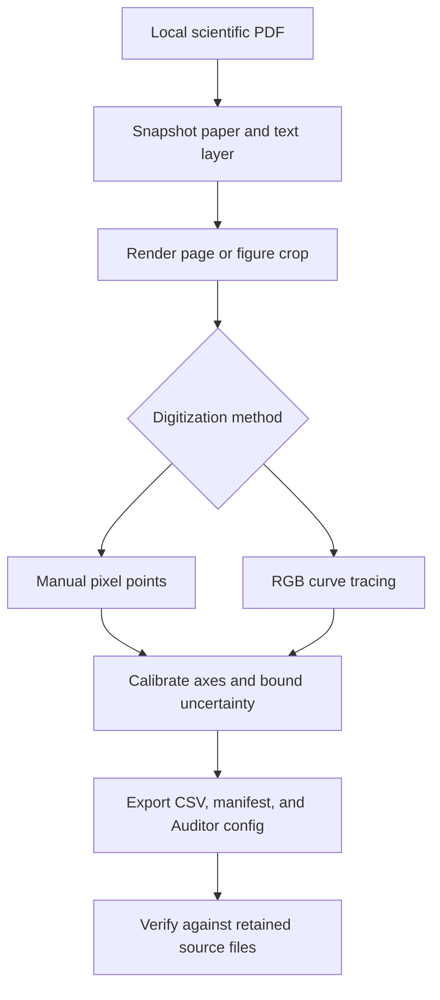

<div align="center">

# Scientific Evidence Engine

**From published figures to traceable scientific datasets.**

Turn plot pixels into numerical values while preserving the source, calibration, units, and digitization uncertainty behind every point.

[](https://github.com/yukevindai/scientific-evidence-engine/actions/workflows/tests.yml)
[](pyproject.toml)
[](LICENSE)


[Quick start](#quick-start) · [Workflow](#how-it-works) · [Capabilities](#what-you-can-do) · [Documentation](#documentation) · [Roadmap](#project-status)

</div>

---

Scientific data often lives inside a figure. Reusing it means tracking more than the extracted numbers: which paper and curve they came from, how the axes were calibrated, and what uncertainty the extraction introduces.

**Scientific Evidence Engine** is a local Python toolkit for chemistry, materials science, and chemical engineering. Its **Figure-to-Dataset Validator** turns figures from user-supplied PDFs into inspectable datasets, with portable exports for [ChemData Auditor](https://github.com/yukevindai/chemdata-auditor).

> **Current scope:** Figure ingestion, digitization, provenance, and export verification are implemented. The **Evidence-Grounded Research Agent**—linking claims to exact evidence and producing inspectable research reports—is planned.

## What you can do

| Capability | What it preserves or checks |
| :--- | :--- |
| **Snapshot a paper** | Original PDF bytes, SHA-256 hash, extracted text layer, and user-supplied bibliographic metadata. |
| **Capture a figure** | Reproducible page crops with page number, figure label, render scale, pixel coordinates, and image hash. |
| **Digitize a curve** | Manually selected points or automatic RGB color tracing with explicit extraction settings. |
| **Calibrate the axes** | Linear or logarithmic mappings, axis labels, declared units, and calibration anchors. |
| **Bound digitization uncertainty** | Nominal values and lower/upper bounds derived from supplied pixel and anchor uncertainties. |
| **Inspect extraction findings** | Ambiguous trace columns, affected rows, provenance gaps, and recommended review actions. |
| **Export and verify** | CSV data, a provenance manifest, and an Auditor configuration, with integrity checks against retained sources. |

**Runs locally · No API key required · No hosted model calls**

## How it works



Each dataset retains its paper and figure identities, extraction configuration, units, findings, and software versions. Keep the source store alongside the export to inspect the complete provenance chain.

## Quick start

Requires **Python 3.10+**. Run these commands in a virtual environment:

```bash
git clone https://github.com/yukevindai/scientific-evidence-engine.git
cd scientific-evidence-engine
python -m pip install -e ".[dev]"

python examples/demo.py outputs/demo
evidence-engine verify outputs/demo/dataset --store outputs/demo/store
```

The demo generates a **synthetic PDF**, traces its red curve, and exports a verified dataset. It does not download literature or use experimental data. Use a new destination for each run; existing output directories are never overwritten.

| Demo output | Contents |
| :--- | :--- |
| `outputs/demo/synthetic-paper.pdf` | Generated source figure for the demonstration. |
| `outputs/demo/store/` | Retained paper, text, figure image, and provenance records. |
| `outputs/demo/digitize-config.json` | Color-tracing and axis-calibration settings. |
| `outputs/demo/dataset/dataset.csv` | Extracted points with source identifiers, units, and uncertainty. |
| `outputs/demo/dataset/manifest.json` | Extraction evidence and export integrity metadata. |
| `outputs/demo/dataset/auditor-config.json` | Configuration for downstream dataset auditing. |

## Work with your own paper

### 1. Register the source

Create `metadata.json` with at least a title:

```json
{
  "title": "Paper title"
}
```

Then ingest the PDF:

```bash
evidence-engine ingest paper.pdf --store workspace --metadata metadata.json
```

DOI, URL, authors, year, license, and notes are optional metadata. These fields remain explicitly user-supplied assertions.

### 2. Capture the figure

```bash
evidence-engine render --store workspace --paper PAPER_ID --page 3 --label "Figure 2a" --scale 2 --crop 100 200 900 800
```

Replace `PAPER_ID` with the full `paper_…` identifier returned by ingestion. Page numbers start at **1**. Adjust the page and crop to your source: crop bounds use **rendered page pixels**, with the origin at the top left.

### 3. Calibrate and digitize

Create `digitize.json` using the [configuration guide](docs/FIGURE_VALIDATOR.md). Choose manual points or color tracing, then specify the series, axes, units, calibration anchors, and uncertainty assumptions.

```bash
evidence-engine digitize --store workspace --figure FIGURE_ID --config digitize.json --output outputs/curve
```

Replace `FIGURE_ID` with the full `figure_…` identifier returned by rendering. Calibration anchors and curve points use pixels **relative to the resulting crop**, also with a top-left origin.

### 4. Verify the export

```bash
evidence-engine verify outputs/curve --store workspace
```

Verification checks exported CSV bytes, row/schema counts, extraction identity, provenance references, and Auditor settings. Adding `--store` also checks retained original PDF and figure image bytes.

## Connect to ChemData Auditor

With [ChemData Auditor](https://github.com/yukevindai/chemdata-auditor) installed in the same environment:

```bash
chemdata audit outputs/curve/dataset.csv --config outputs/curve/auditor-config.json --output outputs/audit.json
```

For split leakage checks, add your partition column and set `split_column` in the Auditor configuration. Preserve `paper_id` and `figure_id` as grouping columns, and add experiment, cell, or formulation identities when available.

> **Scientific independence matters:** Hundreds of digitized points from one curve are not hundreds of independent experiments. Paper and figure identifiers support grouping, but a DOI alone cannot detect reused experiments across publications.

## Interpretation and limits

| Topic | What to keep in mind |
| :--- | :--- |
| **Uncertainty** | Bounds describe digitization under declared calibration and pixel assumptions. They are not experimental error bars, standard deviations, or confidence intervals. |
| **Automation** | Color tracing accepts a single contiguous vertical run per sampled column. Ambiguous or overly thick runs are omitted; there is no smoothing, interpolation, or gap filling. |
| **Supported figures** | Separable Cartesian linear/logarithmic axes. Broken axes, perspective distortion, overlapping curves, and other complex layouts require explicit handling. |
| **Source extraction** | PDF text-layer extraction only; no OCR or automatic axis recognition. |
| **Integrity** | Hashes detect changes relative to recorded snapshots. They do not authenticate a publisher or establish scientific correctness. |
| **Validation** | Tests use controlled synthetic PDFs. Representative real-paper validation is still needed before relying on unattended extraction. |

See [scope and limitations](docs/LIMITATIONS.md) for details. Export manifests omit full papers and images; retain the local source store for a complete review.

## Project status

| Component | Status | Scope |
| :--- | :--- | :--- |
| **Figure-to-Dataset Validator** | Implemented | PDF snapshots, reproducible crops, calibrated digitization, uncertainty bounds, and verified exports. |
| **ChemData Auditor handoff** | Implemented | Portable dataset and configuration exports for downstream quality checks. |
| **Evidence-Grounded Research Agent** | Planned | Exact evidence locations, explicit supporting/contradicting claim links, and inspectable research reports. |

## Documentation

| Guide | Start here for… |
| :--- | :--- |
| [Figure-to-Dataset Validator](docs/FIGURE_VALIDATOR.md) | Manual/color extraction configuration, axis calibration, and uncertainty assumptions. |
| [Data contracts](docs/DATA_CONTRACTS.md) | Artifact schemas, identifiers, units, and provenance semantics. |
| [Scope and limitations](docs/LIMITATIONS.md) | Supported inputs, operational bounds, and validation limits. |
| [Runnable demo](examples/demo.py) | A complete synthetic extraction and verification workflow. |

## Development

After installing the development dependencies above:

```bash
python -m pytest -q
```

The package lives in [`src/scientific_evidence_engine/`](src/scientific_evidence_engine/), with tests in [`tests/`](tests/). Its core dependencies are NumPy, Pillow, pypdfium2, and Pint.

## License

[MIT](LICENSE) · Copyright © 2026 Kevin Dai
